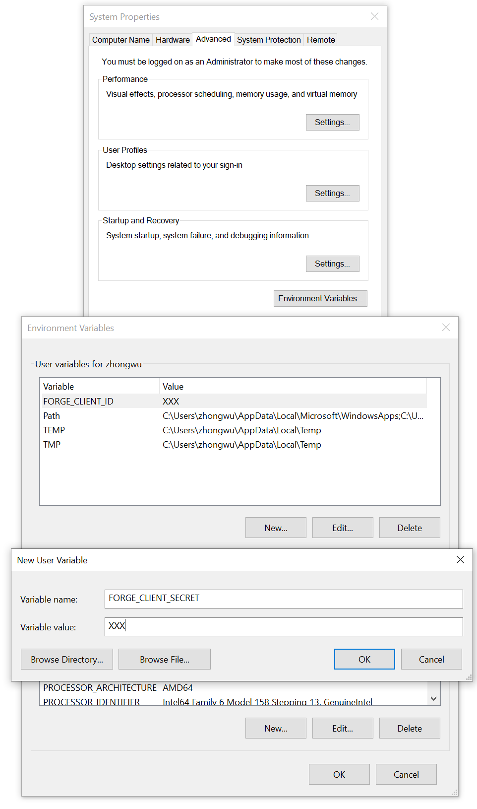

<h1>DEPRECATED</h1>
This repository has been deprecated and all its content was moved to the new one located here https://github.com/autodesk-platform-services/aps-migrate-rcw-addon


# forge-rcw.file.migration-revit.addon
 


[](http://developer.autodesk.com/)


[](http://opensource.org/licenses/MIT)


# Description
This Revit addon sample is based on the project from Revit 2022 SDK sample (\<SDK install\>\Samples\CloudAPISample\), it is intended for demonstrating the usage of Revit Cloud API. This sample demonstrates the workflow of  migrating a Revit RCW model from `BIM 360 Team` to `BIM 360 Docs`.

The sample addon includes the following features:
1. Access all the contents within BIM 360 Team and Docs by logging with Autodesk Account.
2. Download the Revit models from `BIM 360 Team` to specified local folder from BIM 360 Team.
3. Selected the targeted folder by navigating from BIM 360 Docs, and upload the Revit models from local folder to the targeted folder on BIM 360 Docs.
4. Reload the links to the correct model in the cloud.

# Thumbnail


# Demo
[](https://youtu.be/i_pmWSXhRec "Revit RCW Addon Sample")


# Prerequisites
- Visual Studio (Windows).
- .NET Framework basic knowledge with C#
- Revit API knowledge.


# Disclaimer: Security considerations
- To focus on demonstrating the new Revit API feature, this sample uses the user environment variables to save your Forge keys to simplify the authentication process. This is enough to understand the sample and use for your own. 

- However, the developer should be aware that this approach does not show the best practice when delivering the application to your customers. Please refer to the 'secure-dev' branch of  https://github.com/Autodesk-Forge/forge.wpf.csharp as an example of more secure version of authentication implementation when delivering your application to a customer. 


# Running locally
- For using this sample, you need an Autodesk Forge developer credentials. Visit the [Forge Developer Portal](https://developer.autodesk.com), sign up for an account, then [create an app](https://developer.autodesk.com/myapps/create). For this new app, use http://localhost:3000/api/forge/callback/oauth as Callback URL. Finally take note of the Client ID and Client Secret. 

- Connect your Forge App to a Specific BIM 360 Account, follow the [tutorial](https://forge.autodesk.com/en/docs/bim360/v1/tutorials/getting-started/get-access-to-account/)

- Download the repository, open `RevitCloudSample.sln` Solution on Visual Studio. The build process should download the required packages (**Autodesk.Forge** and dependencies). Compile and build the project.

- Setup the environment variables of your Forge App key following the steps. (Please make sure you keep the keys secure.  Do not share with others, nor expose publicly.)
    1. From the desktop, right-click the very bottom-left corner of the screen to get the Power User Task Menu.
    2. Click System from the Power User Task Menu that’s displayed on the screen.
    3. Under the System menu, you need to click the Advanced System Settings.
    4. In the System Properties window, click the Advanced tab, then click the Environment Variables button near the bottom of that tab.
    5. Add the following environment variables:
```
    FORGE_CLIENT_ID = your_client_key
    FORGE_CLIENT_SECRET = your_client_secret
    FORGE_CALLBACK = http://localhost:3000/api/forge/callback/oauth
```
 

- Before running the plugin, since we need to communicate with 3 legged token callback over HTTP and HTTPS, please run the app with `Admin level`, or at a minimum, you need to configure a URL registration and add a Firewall exception for the URL your service will be using. You can configure these settings with the Netsh.exe tool as follow. Please refer [Configuring HTTP and HTTPS](https://docs.microsoft.com/en-us/dotnet/framework/wcf/feature-details/configuring-http-and-https?redirectedfrom=MSDN) for details.

```powershell
netsh http add urlacl url=http://+:3000/api/forge/callback/oauth/ user=DOMAIN\user
```

# Packages 3rd party libraries used
- The app use [NuGet](https://api.nuget.org/v3/index.json) to manage all the packages
- The [Autodesk.Forge](https://www.nuget.org/packages/Autodesk.Forge/) packages is included by default
- [Newtonsoft.Json](https://www.newtonsoft.com/json)
- [NLog](https://nlog-project.org/)
- [RestSharp](http://restsharp.org/)


# Further Reading
**Documentation:**
- [Data Management API](https://forge.autodesk.com/en/docs/data/v2/developers_guide/overview/)
- [BIM 360 API](https://developer.autodesk.com/en/docs/bim360/v1/overview/) and [App Provisioning](https://forge.autodesk.com/blog/bim-360-docs-provisioning-forge-apps)
- [Revit SDK](https://www.revitapidocs.com/)


# Tips & Tricks
- If you run the application, and meet the exception of assembly `Autodesk.Forge` cannot be loaded, you can solve this by copying the assembly (together with dependencies) to the roaming folder of your Revit plugin.

- Before running the plugin, since we need to communicate with 3 legged token callback over HTTP and HTTPS. At a minimum, you want to configure a URL registration and add a Firewall exception for the URL your service will be using. You can configure these settings with the Netsh.exe tool as follow. 
```powershell
netsh http add urlacl url=http://+:3000/api/forge/callback/oauth/ user=DOMAIN\user
```
Please refer [Configuring HTTP and HTTPS](https://docs.microsoft.com/en-us/dotnet/framework/wcf/feature-details/configuring-http-and-https?redirectedfrom=MSDN) for details.

# Limitation & Known issue
- Currently,  the tool support downloading Revit models from BIM 360 Team. You can specify a folder, and all the files under the folder will be downloaded. But there is no sign to notification when all the files are downloaded. Please check the local folder to make sure all the files are fully downloaded before uploading to BIM 360 Docs.   

- After logging with user account, the app will iterate all the projects and folders from BIM 360 Team and Docs, you will see the projects and folders show up gradually. Be patient if you don't see the folder that you are interested in.

- The 3 legged token will be expired in 30 minutes. The refresh token is not kept and made to refresh the access token automatically. You need to login again if the token is expired. Feel free to improve this feature.

- Please DO keep the Forge App key under your user environment variable. Not expose to others.

# License
- This sample is licensed under the terms of the [MIT License](http://opensource.org/licenses/MIT). Please see the [LICENSE](LICENSE.md) file for full details.


# Written by
- Zhong Wu [@johnonsoftware](https://twitter.com/johnonsoftware), [Forge Partner Development](http://forge.autodesk.com)
- Based on the original sample `CloudAPISample` under Revit SDK 2022 by Will Gu, Software Developer, Autodesk.
